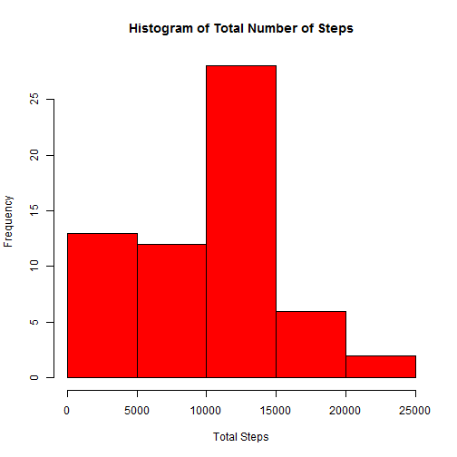
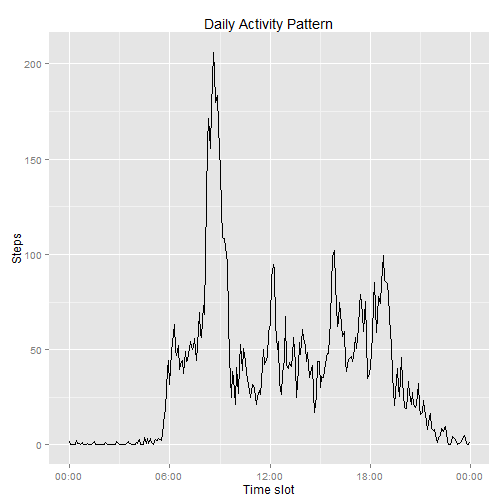
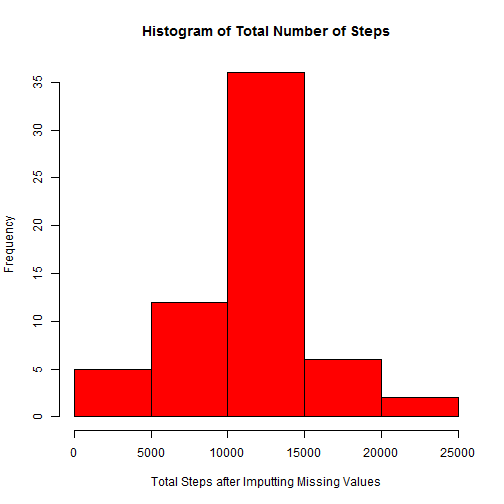

# Reproducible Research: Peer Assessment 1
==============================================

## Loading and preprocessing the data


```r
# load data from csv
activity <- read.csv("activity.csv")

# calculate total number of steps taken each day
totalSteps <- tapply(activity$steps, activity$date, sum, na.rm = TRUE)
stepsFrame <- as.data.frame(totalSteps)
stepsFrame <- cbind(names(totalSteps), stepsFrame)
names(stepsFrame) <- c("Date", "Steps")
```

## Make a histogram of the total number of steps taken each day

```r
hist(stepsFrame$Steps,main="Histogram of Total Number of Steps", xlab="Total Steps",
     col="red")
```

 

## What is mean total number of steps taken per day?

```r
originalMean <- mean(totalSteps, na.rm = TRUE)
originalMean
```

```
## [1] 9354
```

## What is median total number of steps taken per day?

```r
originalMedian <- median(totalSteps, na.rm = TRUE)
originalMedian
```

```
## [1] 10395
```

## What is the average daily activity pattern?

1. Make a time series plot (i.e. type = "l") of the 5-minute interval (x-axis) and the average number of steps taken, averaged across all days (y-axis)


```r
# calculate means per interval
intervalMean <- tapply(activity$steps, activity$interval, mean, na.rm = TRUE)
# create a data frame with the result
intervalFrame <- as.data.frame(intervalMean)
intervalFrame <- cbind(names(intervalMean), intervalFrame)
names(intervalFrame) <- c("Interval", "Steps")

# pad intervals with leading 0's, so that each consisted of 4 numbers
require("stringr")
```

```
## Loading required package: stringr
```

```r
intervalFrame$TimeInterval <- str_pad(intervalFrame$Interval, width=4, pad="0")

# create datetime variable
require("lubridate")
```

```
## Loading required package: lubridate
```

```r
intervalFrame$TimeInterval <- parse_date_time(intervalFrame$TimeInterval,"%H%M")

# Create a line plot with average daily activity
require("ggplot2")
```

```
## Loading required package: ggplot2
```

```r
require("scales")
```

```
## Loading required package: scales
```

```r
p <- qplot(TimeInterval, Steps, data = intervalFrame, geom = "line", main="Daily Activity Pattern")
p <- p + xlab("Time slot") 
p <- p + scale_x_datetime(labels = date_format("%H:00"))
print(p)
```

 

2. Which 5-minute interval, on average across all the days in the dataset, contains the maximum number of steps?


```r
maxIdx <- which.max(intervalFrame$Steps)
inter <- intervalFrame$Interval[maxIdx]
timeInter <- format(intervalFrame$TimeInterval[maxIdx],"%H:%M")
```

Interval with the maximum number of steps is 835. It interval corresponds to 08:35.


## Imputing missing values
 1. The totals number of missing values is
 

```r
sum(is.na(activity$steps))
```

```
## [1] 2304
```
 
 2. I will use the mean for the time interval to impute the missing values. I believe the activity interval  gives the best approximation for the missing values.
 
 3. Here is the sample of the dataset with the missing values substituted with the time interval's mean:

```r
for (i in 1:length(activity$steps)) {
    if (is.na(activity$steps[i])) {
      interval <- activity$interval[i]      
      activity$steps[i] <- intervalFrame$Steps[intervalFrame$Interval == interval]
    }
}
head(activity)
```

```
##     steps       date interval
## 1 1.71698 2012-10-01        0
## 2 0.33962 2012-10-01        5
## 3 0.13208 2012-10-01       10
## 4 0.15094 2012-10-01       15
## 5 0.07547 2012-10-01       20
## 6 2.09434 2012-10-01       25
```

```r
sum(is.na(activity$steps))
```

```
## [1] 0
```
 
 4. Make a histogram of the total number of steps taken each day and Calculate and report the mean and median total number of steps taken per day. Do these values differ from the estimates from the first part of the assignment? What is the impact of imputing missing data on the estimates of the total daily number of steps?
 

```r
# calculate total steps taken per day
totalInputSteps <- tapply(activity$steps, activity$date, sum, na.rm = TRUE)
stepsInputFrame <- as.data.frame(totalInputSteps)
stepsInputFrame <- cbind(names(totalInputSteps), stepsInputFrame)
names(stepsInputFrame) <- c("Date", "Steps")

hist(stepsInputFrame$Steps,main="Histogram of Total Number of Steps", xlab="Total Steps after Imputting Missing Values",col="red")
```

 


Mean has increased. If the original was 9354.2295, the mean after imputting missing values:

```r
mean(totalInputSteps)
```

```
## [1] 10766
```


Median has increased as well. The original was 10395. Median after imputting missing values:

```r
median(totalInputSteps)
```

```
## [1] 10766
```


## Are there differences in activity patterns between weekdays and weekends?

The activity pattern seems to be more even during the weekend. During the weekday,  activity peak falls between 8 and 10 am.


```r
# create factor column separating weekdays from weekends
activity$weekday <- ifelse(!(weekdays(as.Date(activity$date)) %in% c('Saturday','Sunday')), 'weekday', 'weekend') 
activity$weekday <- as.factor(activity$weekday)

# calculate mean for each interval on the weekend and weekdays
intervalWeekdayMean <- aggregate(activity$steps, by=list(activity$weekday,activity$interval), FUN="mean")
names (intervalWeekdayMean) <- c("weekday", "interval", "steps")

# plot both patterns
require(lattice)
```

```
## Loading required package: lattice
```

```r
xyplot(steps~interval|weekday,data=intervalWeekdayMean,type="l",layout = c(1,2))
```

 
